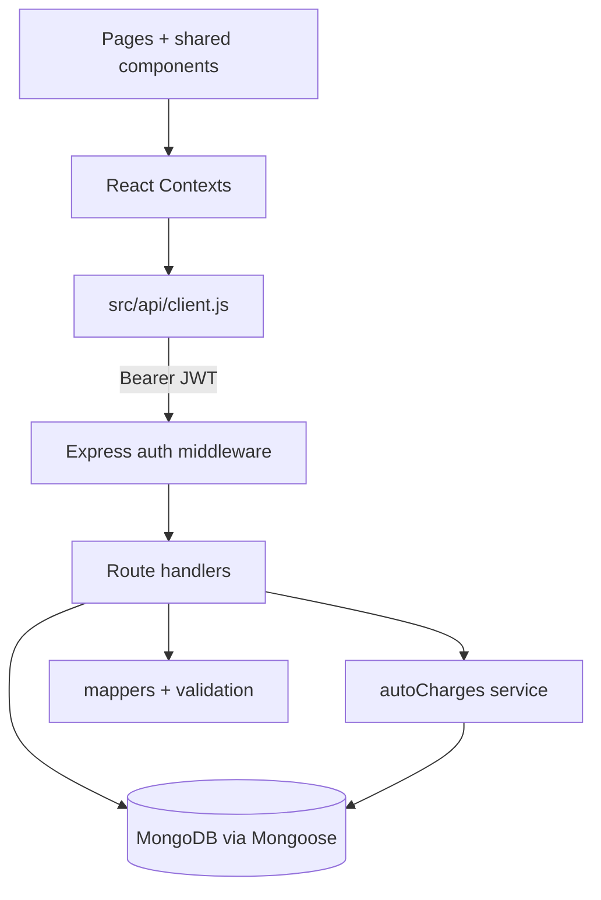
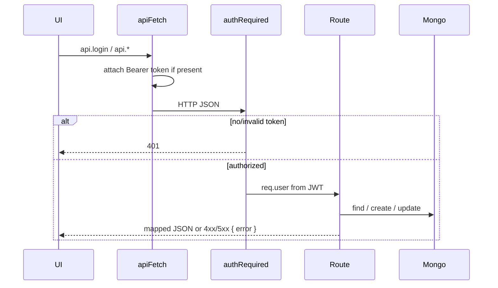

# Architecture

Related documents: [PROJECT_CONTEXT.md](./PROJECT_CONTEXT.md) · [FOLDER_STRUCTURE.md](./FOLDER_STRUCTURE.md) · [MODULES.md](./MODULES.md)

---

## Architecture pattern

The system is a **two-package SPA + REST API**:

| Package | Location | Pattern |
|---------|----------|---------|
| Frontend | repository root | React SPA, Context state, route-level authorization |
| Backend | `/server` | Express routers + Mongoose models + one charge-generation service |

It is **not** a clean hexagonal / repository architecture. Route files query models directly. There is no DI container, no separate controller/service split except `autoCharges.js`, and no shared TypeScript types.

A **dual-runtime frontend** is first-class:

- Default: talk to the API (`VITE_USE_API` unset or any value other than `'false'`).
- Optional: in-browser mock (`VITE_USE_API=false`) using `src/data/mockData.js`.

---

## Layer responsibilities



| Layer | Responsibility | Does not do |
|-------|----------------|-------------|
| Pages | Role-specific screens, forms, print UI | Persist data directly |
| Contexts | Session cache, mutations, balance helpers | Own HTTP details beyond `api.*` |
| `api/client.js` | Base URL, token header, JSON errors | Retry, refresh, request cancellation |
| Auth middleware | Verify JWT; optional role gate | Load full user on every request (`attachUser` exists but is unused) |
| Routes | Validate, mutate, respond | Transactions / locking |
| `autoCharges.js` | Upsert daily room/doctor records; compute balance | HTTP |
| Mappers | Shape Mongo documents for the SPA | Enforce business rules |
| Validation utils | Admit / deposit / transfer checks | Schema-level Mongoose validators beyond required/enum |

---

## Frontend architecture

### Provider tree

Defined in `src/App.jsx`:

```
ThemeProvider
  ToastProviderWrapper
    AuthProvider
      PatientsProvider
        BillingConfigProvider
          ServiceEntriesProvider
            BrowserRouter
```

`ServiceEntriesProvider` depends on `usePatients` and `useBillingConfig`. `PatientsProvider` and `BillingConfigProvider` depend on `useAuth` so they wait for `authReady` before fetching.

### Routing

- `/` and unknown paths redirect to `/login`.
- Each role is wrapped in `<RequireAuth role="..." />`.
- Wrong-role users are redirected to their `dashboardPath`, not to a 403 page.

Route map: see [FOLDER_STRUCTURE.md](./FOLDER_STRUCTURE.md) and [AUTHENTICATION.md](./AUTHENTICATION.md).

### State management

React Context only. No Redux, Zustand, or React Query. Lists are fetched once after login and updated locally after mutations. There is no background refetch or websocket.

### UI kit

`frontend/src/components/ui/*` are Radix-based primitives (shadcn-style). Shared domain widgets live in `frontend/src/components/shared/`. Layout chrome is `AppLayout` + `Sidebar` + `TopNav`.

---

## Backend architecture

```
server/server.js
  ├── config/db.js
  ├── middleware/auth.js
  ├── routes/*.routes.js
  ├── models/*.js
  ├── services/{autoCharges,discharge}.js
  └── utils/{validation,mappers}.js
```

`server.js` mounts:

| Prefix | Router file |
|--------|-------------|
| `/api/health` | inline |
| `/api/auth` | `auth.routes.js` |
| `/api/patients` | `patients.routes.js` |
| `/api/beds` | `beds.routes.js` |
| `/api/settings` | `settings.routes.js` |
| `/api/records` | `records.routes.js` |
| `/api/manager` | `manager.routes.js` |

There is **no global error-handling middleware**. Each handler uses `try/catch` and returns `{ error: string }`.

---

## Request lifecycle



1. `apiFetch` sets `Content-Type: application/json` and `Authorization: Bearer <token>`.
2. CORS allows `CORS_ORIGIN` (default `http://localhost:5173`) with credentials.
3. Body is parsed with `express.json()`.
4. Protected routes run `authRequired`. Some also run `requireRole(...)`.
5. Handler validates, writes, maps, and responds.
6. On non-OK, the client throws `Error(data.error)`.

Unauthenticated public routes: `GET /api/health`, `POST /api/auth/login`.

---

## Dependency flow

**Frontend (allowed direction):** pages → hooks/contexts → `api/client` → HTTP.

**Backend (allowed direction):** routes → services/utils/models → MongoDB.

Cross-package: the SPA depends on the API contract documented in [API_REFERENCE.md](./API_REFERENCE.md). The API does not import frontend code.

---

## Module interactions

| From | To | How |
|------|----|-----|
| AuthContext | api.login / api.me | Session bootstrap |
| PatientsContext | `/api/patients?view=full` | Patients, deposits, assignments, rooms |
| BillingConfigContext | `/api/settings`, `/api/settings/categories` | Hospital config |
| ServiceEntriesContext | `/api/records`, patient record posts | Charges and approvals |
| useManagerDashboard | `/api/manager/dashboard` | KPIs |
| Patient admit | Patient + Bed + RoomAssignment + Deposit + autoCharges | Single route, sequential writes (no transaction) |
| Room transfer | Close assignment, swap beds, new assignment, recalc charges | Single route, sequential writes |
| Record approve | ServiceRecord status + audit trail | Balance changes on next read |

---

## Shared utilities

| Location | Role |
|----------|------|
| `src/lib/utils.js` | `cn`, currency/date formatters, balance-status helper |
| `src/lib/validation.js` | Client admission/deposit/transfer/cart rules |
| `src/lib/printReport.js` | Manager report print HTML + CSV |
| `server/utils/validation.js` | Server admit/deposit/transfer rules |
| `server/utils/mappers.js` | API response shape for the SPA |

Client and server validation overlap (minimum deposit, transfer dates, non-cash reference numbers) but are **duplicated**, not shared.

---

## Reusable abstractions

| Abstraction | Used for |
|-------------|---------|
| `ServiceRecordBuilder` | Nurse and reception charge entry |
| `RecordTimeline` / `RecordDetailView` | Record history and approval detail |
| `RoomTransferPanel` / `RoomHistoryTable` | Transfers and assignment history |
| `DepositReceipt` | Printable deposit slip |
| `StatCard`, `DataTable`, `PageHeader`, `StatusBadge` | Dashboard tables and badges |
| `RequireAuth` | Role route gate |
| `calcPatientBalance` / `computeRecordTotal` | Financial totals |
| `ensureAutomaticDailyCharges` | Daily room/doctor lines |

---

## Dual-mode implication

Every mutating context method has an `if (USE_API)` branch and a mock branch. Mock behavior can differ from the API (for example, editing a pending record updates in place locally; the API always `create`s a new `ServiceRecord`). Treat the **API path as the source of truth** for production behavior. See [KNOWN_ISSUES.md](./KNOWN_ISSUES.md).
