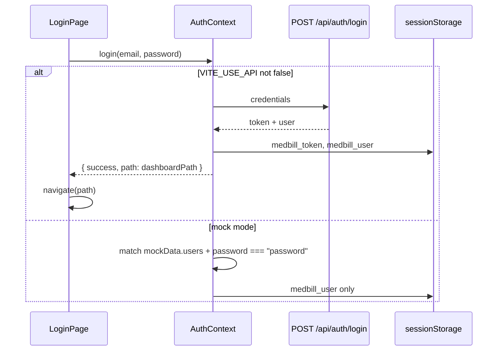

# Authentication

Related documents: [API_REFERENCE.md](./API_REFERENCE.md) · [SECURITY.md](./SECURITY.md) · [ENVIRONMENT.md](./ENVIRONMENT.md)

---

## Login flow

1. `/login` requires email and password (client toast if empty).
2. API mode: `api.login` → store JWT and mapped user → navigate to `user.dashboardPath`.
3. Mock mode: user must exist in `src/data/mockData.js`, password must equal `DEMO_PASSWORD` (`password`), and `status` must be `active`.
4. Authenticated users hitting `/login` are redirected to their dashboard.
5. `/` always redirects to `/login` (there is no role-picker landing page).

On API-mode startup, if `medbill_token` exists, `GET /api/auth/me` rehydrates the user. Failure clears token and user.

---

## JWT

| Property | Implementation |
|----------|----------------|
| Library | `jsonwebtoken` |
| Algorithm | library default HS256 |
| Secret | `process.env.JWT_SECRET` (required in practice; no fallback) |
| Expiry | `7d` |
| Claims | `id` (User `_id` string), `email`, `role` (capitalized enum), `roleKey` (lowercase), `name` |
| Transport | `Authorization: Bearer <token>` |
| Storage | `sessionStorage.medbill_token` |

No cookie session. CORS `credentials: true` is enabled but unused for cookies.

---

## Refresh tokens

**Not implemented.** When the JWT expires, `authRequired` returns `401` `{ error: "Invalid or expired token" }`. The SPA `me()` bootstrap then logs the user out. There is no silent refresh or `/auth/refresh` route.

---

## Middleware

`server/src/middleware/auth.js`:

| Function | Behavior |
|----------|----------|
| `authRequired` | Missing header → `401 Unauthorized`. Bad/expired token → `401 Invalid or expired token`. Sets `req.user` to JWT payload. |
| `requireRole(...roles)` | Compares `req.user.role` to **capitalized** role names (`Admin`, `Manager`). Mismatch → `403 Forbidden`. |
| `attachUser` | Loads `User` without password into `req.dbUser`. **Not used** by any router. |

Role checks that exist today:

| Route | Roles |
|-------|-------|
| `PUT /api/settings` | Admin |
| `PATCH /api/settings/categories/:slug/billing-type` | Admin |
| `GET /api/manager/dashboard` | Manager, Admin |
| `GET /api/manager/reports/:type` | Manager, Admin |

All other `/api/patients`, `/api/records`, `/api/beds` routes: **any authenticated role**.

---

## Role checking (frontend)

`RequireAuth` (`src/components/auth/RequireAuth.jsx`):

1. Wait for `authReady` (shows “Loading...”).
2. If not authenticated → `/login`.
3. If `role` prop set and `user.roleKey !== role` → `user.dashboardPath`.

`roleKey` values: `reception`, `nurse`, `admin`, `manager`.

Sidebar menus are static per layout role; they are not permission flags.

---

## Permission system

There is **no permission matrix**, no claims beyond role, and no resource-level ACL.

UI conventions (not enforced by the API):

| Capability | Reception UI | Nurse UI | Admin UI | Manager UI |
|------------|--------------|----------|----------|------------|
| Admit / deposit / transfer / approve | Yes | No | No | No |
| Record services | Yes (auto-approve) | Yes (pending, `hideMoney`) | No | No |
| Settings write | No | No | Yes | No |
| Reports | No | No | API allowed | Yes |

A nurse JWT can still call admit/approve/deposit endpoints directly.

Record `source` is a **client-supplied** field. Sending `source: "reception"` auto-approves the record regardless of the caller’s role.

---

## Protected routes

See the table in [FOLDER_STRUCTURE.md](./FOLDER_STRUCTURE.md). All dashboard trees sit behind `RequireAuth`. Public: `/login` only (plus redirects).

Search in `TopNav` is a visual input only — it does not query patients.

---

## Session lifecycle

| Event | Behavior |
|-------|----------|
| Login success | Token + JSON user in `sessionStorage` |
| Tab close | `sessionStorage` cleared (new tab = logged out) |
| Logout | `user` null, token removed, `medbill_user` removed, navigate `/login` |
| Token invalid on boot | Cleared; user sees login |
| Inactive user | Login rejected; already-issued JWT still works until expiry (`/me` does not re-check `status`) |

Theme preference is separate (`localStorage.theme`) and is not part of the auth session.

---

## Demo credentials

Seeded and shown on the login page from `mockData.users`:

| Email | Role | Password |
|-------|------|----------|
| reception@cc | Reception | password |
| nurse@cc | Nurse | password |
| admin@cc | Admin | password |
| manager@cc | Manager | password |

`BACKEND_TODO.txt` and `users.txt` mention `@stgabriel.et` addresses. Those are **not** seeded.
