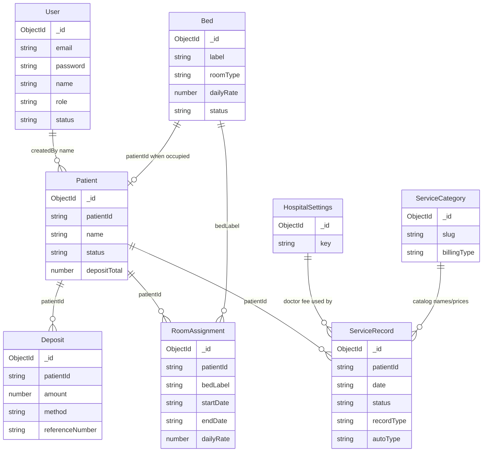

# Database

Related documents: [MODULES.md](./MODULES.md) · [API_REFERENCE.md](./API_REFERENCE.md) · [BUSINESS_RULES.md](./BUSINESS_RULES.md)

**Engine:** MongoDB via Mongoose 8.  
**Default URI:** `mongodb://127.0.0.1:27017/medbill`  
**Migrations:** None. Schema is implied by models + `scripts/seed.js`.  
**Transactions:** Not used. Multi-document writes are sequential.

There is no `Invoice`, `Payment` (separate from Deposit), `Role`, or `AuditLog` collection. Audit events are embedded on `ServiceRecord`. Roles are an enum on `User`.

---

## Entity-relationship diagram

Foreign keys are **application-level strings** (`patientId`, `bedLabel`), not Mongoose `ref` / `ObjectId` references (except unused opportunities). Deleting a patient would orphan related documents — no cascade is implemented.

---

## User

**Purpose:** Staff login identity and role.

| Field | Type | Constraints |
|-------|------|-------------|
| email | String | required, unique, stored lowercase |
| password | String | required, bcrypt hash |
| name | String | required |
| role | String | enum `Reception`, `Nurse`, `Admin`, `Manager` |
| status | String | enum `active`, `inactive`; default `active` |
| createdAt / updatedAt | Date | timestamps |

**Indexes:** unique on `email`.  
**Lifecycle:** Created by seed (or unknown admin process). Login requires `status === 'active'`. No user API exists.

---

## Patient

**Purpose:** One in-patient admission record (the document *is* the stay; there is no separate Admission collection).

| Field | Type | Constraints |
|-------|------|-------------|
| patientId | String | required, unique (e.g. `PAT-001`) |
| name | String | required |
| age | Number | optional |
| dateOfBirth | String | optional ISO date |
| gender | String | required |
| phone | String | optional |
| address | String | required |
| emergencyContact | String | optional; not collected on admit |
| emergencyPhone | String | optional; not collected on admit |
| mrn | String | sparse unique |
| nationalId | String | sparse unique |
| admissionReason | String | optional; not collected on admit |
| admissionDate | String | required on the document (`YYYY-MM-DD`); defaults to today if omitted on admit |
| status | String | enum `admitted`, `pending-discharge`, `discharged`; default `admitted` |
| pendingDischarge | Boolean | synced with `status === 'pending-discharge'` |
| dischargeRequestedBy / At / Notes | String / Date / String | current nurse request |
| dischargeRejectedBy / At / Reason | String / Date / String | last rejection |
| dischargeCompletedBy / At | String / Date | reception approval |
| dischargeFinalCharges / Deposits / Balance | Number | snapshot at completion |
| dischargeEvents | [{ action, by, at, note }] | request / reject / approve audit |
| room | String | denormalized current room type |
| bed | String | denormalized current bed label |
| bedId | String | Bed `_id` string at admit/transfer |
| depositTotal | Number | default 0; incremented on deposits |
| requiredInitialDeposit | Number | required admit deposit (currently 15,000) |
| admissionPaymentMode | String | `paid` or `credit` |
| isCreditPatient | Boolean | true while credit admit still has unpaid required deposit |
| creditMarkedBy / creditMarkedAt | String / Date | who marked the admit as credit |
| disabledDoctorVisitDates | [String] | dates with no doctor charge |
| createdBy / updatedBy | String | staff display names |
| createdAt / updatedAt | Date | timestamps |

**Indexes:** unique `patientId`; sparse unique `mrn`, `nationalId`.  
**Relationships:** 1:N Deposit, RoomAssignment, ServiceRecord, DoctorAssignment.  
**Lifecycle:** Created on admit with `status: 'admitted'`. Nurse request → `pending-discharge`. Reception reject → `admitted`. Reception approve → `discharged`. Default lists exclude `discharged`; `GET /api/patients/discharged` returns history.

**Admit uniqueness (application):** active (non-discharged) patients cannot share the same `mrn` or `nationalId` if those fields are provided.

---

## Deposit

**Purpose:** A received payment / deposit against a patient.

| Field | Type | Constraints |
|-------|------|-------------|
| patientId | String | required, indexed |
| amount | Number | required |
| method | String | required (`Cash`, `Bank Transfer`, `Ebirr`, `Other` in UI) |
| referenceNumber | String | sparse unique index |
| date | String | required |
| receivedBy | String | staff name |
| isInitial | Boolean | default false |
| createdAt / updatedAt | Date | timestamps |

**Indexes:** `{ patientId: 1 }`; unique sparse `{ referenceNumber: 1 }` (declared twice in the schema file — same intent).  
**Lifecycle:** Created on admit (if amount > 0, `isInitial: true`) or via add-deposit. Never updated or voided in current code.

---

## Bed

**Purpose:** Physical bed inventory and occupancy.

| Field | Type | Constraints |
|-------|------|-------------|
| label | String | required, unique (`GW-12`) |
| roomType | String | required |
| dailyRate | Number | required (copied onto assignments) |
| status | String | enum `available`, `occupied`; default `available` |
| patientId | String | null when free |
| createdAt / updatedAt | Date | timestamps |

**Indexes:** unique `label`.  
**Lifecycle:** Seeded. Occupied on admit/transfer; freed on transfer and on completed discharge.

---

## RoomAssignment

**Purpose:** Time-bounded stay in a bed, with rate locked at assignment.

| Field | Type | Constraints |
|-------|------|-------------|
| patientId | String | required, indexed |
| bedId | String | required (stores **label**, not Mongo `_id`) |
| roomType | String | |
| bedLabel | String | |
| startDate | String | required |
| endDate | String | default null = current |
| dailyRate | Number | required |
| reason | String | “Initial admission” or transfer reason |
| assignedBy | String | |
| createdAt / updatedAt | Date | timestamps |

**Indexes:** `{ patientId: 1 }`.  
**Lifecycle:** Open assignment (`endDate: null`) closed on transfer; new row inserted. Used by `getRoomForDate` (`startDate <= date` and `endDate` null or `> date`).

---

## ServiceRecord

**Purpose:** A day’s services, a pharmacy return, or an automatic charge.

| Field | Type | Constraints |
|-------|------|-------------|
| patientId | String | required, indexed |
| recordName | String | usually patient name |
| date | String | required |
| status | String | enum `pending`, `approved`, `rejected`; default `pending` |
| recordType | String | enum `daily`, `return`, `manual`; default `daily` |
| source | String | enum `nurse`, `reception`, `system`; default `nurse` |
| autoType | String | enum `room`, `doctor`, or null |
| autoGenerated | Boolean | default false |
| services | [ServiceLine] | embedded |
| returnItems | [ReturnLine] | embedded |
| submittedBy / approvedBy | String | |
| rejectionReason | String | |
| recordedAt / reviewedAt | Date | |
| auditTrail | [AuditEntry] | embedded |
| createdAt / updatedAt | Date | timestamps |

**ServiceLine:** `id`, `category`, `serviceName`, `quantity` (default 1), `unitPrice`, `total`, `notes`, optional `doctorId`, optional `specialty` — no `_id`.  
**ReturnLine:** `id`, `serviceName`, `quantity`, `unitPrice`, `total`, `reason`.  
**AuditEntry:** `action`, `by`, `at`, `note`.

**Indexes:** `{ patientId: 1 }`; unique partial `{ patientId, date, autoType }` where `autoType` is `room` or `doctor`.

**Lifecycle:**

- Nurse daily/return → `pending` → reception approve/reject
- Reception daily/return → created `approved`
- System auto → created/updated `approved`; doctor line deleted if visit disabled

---

## Doctor

**Purpose:** Hospital visiting-doctor catalog. Prices here are for **new** assignments only.

| Field | Type | Constraints |
|-------|------|-------------|
| name | String | required |
| specialty | String | required (controlled list) |
| visitPrice | Number | required, ≥ 0 |
| active | Boolean | default true |
| phone / department | String | optional |
| createdBy / updatedBy | String | |
| auditTrail | [AuditEntry] | created/updated notes |
| createdAt / updatedAt | Date | timestamps |

**Indexes:** `{ name, specialty }`, `{ active }`.

---

## DoctorAssignment

**Purpose:** Links a stay (`patientId`) to a doctor for a date range, with locked name/specialty/price.

| Field | Type | Constraints |
|-------|------|-------------|
| patientId | String | required |
| doctorId | String | Doctor `_id` string |
| doctorNameSnapshot / specialtySnapshot | String | required |
| visitPriceSnapshot | Number | required, ≥ 0 |
| effectiveFrom | String | `YYYY-MM-DD` |
| effectiveTo | String | null while active; exclusive end |
| assignedBy / assignedAt | String / Date | |
| status | String | `active` or `ended` |
| endedBy / endedAt | String / Date | |

**Indexes:** unique partial `{ patientId, doctorId }` where `status === 'active'` (one active assignment per doctor per stay).

---

## ServiceCategory

**Purpose:** Catalog of billable items and how they are entered.

| Field | Type | Constraints |
|-------|------|-------------|
| slug | String | required, unique |
| name | String | required |
| description | String | |
| billingType | String | enum `quantity`, `selection`, `automatic_daily`; default `quantity` |
| services | [{ name, price }] | embedded, no `_id` |
| createdAt / updatedAt | Date | timestamps |

**Indexes:** unique `slug`.  
**Lifecycle:** Seeded. Only `billingType` is updated via API. Item prices are not editable through an API.

Seeded slugs: `pharmacy`, `medical-supplies`, `consumables`, `laboratory`, `procedures`, `radiology`, `doctor`, `room`.

---

## HospitalSettings

**Purpose:** Single hospital + billing configuration document.

| Field | Type | Constraints |
|-------|------|-------------|
| key | String | default `default`, unique |
| name | String | |
| address | String | |
| tin | String | |
| currency | String | default `ETB` |
| lowBalanceThreshold | Number | |
| receiptFooter | String | |
| vatPercent | Number | default 0 |
| dailyDoctorVisitFee | Number | |
| dailyDoctorVisitName | String | |
| createdAt / updatedAt | Date | timestamps |

**Lifecycle:** Seeded; upserted on `PUT /api/settings`. `vatPercent` is stored and shown on the Settings page and (from **mock** settings) on the invoice preview. It is **not** applied in `calcPatientBalance`.

Seeded values (may differ from `src/data/mockData.js`):

| Field | Seed |
|-------|------|
| name | Central City Hospital |
| address | Konel, Dire Dawa, Ethiopia |
| tin | 0001234567 |
| lowBalanceThreshold | 3000 |
| vatPercent | 0 |
| dailyDoctorVisitFee | 1000 |
| dailyDoctorVisitName | Daily Doctor Visit |

Mock frontend defaults use address “Bole Road, Addis Ababa, Ethiopia” and doctor fee **2000**.

---

## Collections that do not exist

Despite names in older README examples, there are no tables/collections for:

- Admission (folded into Patient)
- Room (folded into Bed.roomType)
- Invoice
- Payment (Deposit is the only money-in document)
- Role
- AuditLog
- Department
- Medicine (pharmacy items live under ServiceCategory `pharmacy`)
- Notification

---

## Seed data

`npm run seed` (from `/server`) **deletes** Users, Beds, Patients, Deposits, RoomAssignments, ServiceCategories, ServiceRecords, HospitalSettings, Doctors, DoctorAssignments, then inserts:

- 4 users (password hash of `password`, cost 10)
- 44 beds
- 8 categories with catalog items
- 1 settings document
- No sample patients, doctors, deposits, or auto charges. Clinical data is created only by real admissions.
