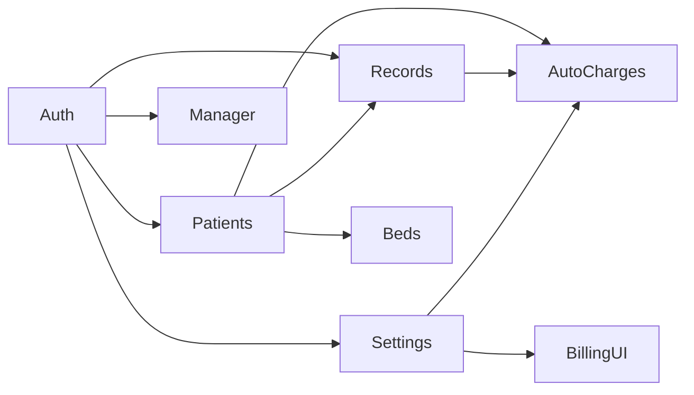

# Modules

Related documents: [ARCHITECTURE.md](./ARCHITECTURE.md) · [API_REFERENCE.md](./API_REFERENCE.md) · [DATABASE.md](./DATABASE.md) · [BUSINESS_RULES.md](./BUSINESS_RULES.md)

There are no Nest/Spring-style modules. A “module” here is a cohesive slice of routes, models, contexts, and pages.

---

## 1. Authentication

**Purpose:** Identify a user and attach a role to the SPA session.

| | |
|-|-|
| **Controllers / routes** | `POST /api/auth/login`, `GET /api/auth/me` |
| **Services** | None — logic is in the route |
| **Entities** | `User` |
| **DTOs** | Response includes `token`, `user.{id,name,email,role,roleKey,dashboardPath,initials}` |
| **Frontend** | `AuthContext.jsx`, `LoginPage.jsx`, `RequireAuth.jsx` |
| **Reusable functions** | `toSessionUser`, `setToken`, `authRequired`, `requireRole` |

**Business logic:** Active users only. Password compared with bcrypt. JWT signed for 7 days. `roleKey` is `user.role.toLowerCase()`.

**Communicates with:** Every authenticated API call. Patients/Billing/Records contexts wait for `authReady` + `isAuthenticated`.

Details: [AUTHENTICATION.md](./AUTHENTICATION.md).

---

## 2. Patients and admissions

**Purpose:** Admit in-patients, list active stays, load a stay with deposits and assignments.

| | |
|-|-|
| **Routes** | `GET /api/patients`, `GET /api/patients?view=full`, `GET /api/patients/:id`, `POST /api/patients`, pending-discharge / discharged lists, discharge request / approve / reject |
| **Entities** | `Patient`, `Deposit`, `Bed`, `RoomAssignment`, `ServiceRecord` |
| **Validation** | `validateAdmitBody` (server), `validateAdmission` (client) |
| **Mappers** | `toFrontendPatient`, `buildRoomHistory` |
| **Frontend** | `PatientsContext`, `AddPatient`, `PatientsList`, `ReceptionDashboard`, nurse lists |

**Responsibilities:**

- Allocate next `PAT-NNN` id
- Occupy a bed
- Create initial room assignment (`reason: 'Initial admission'`)
- Create initial deposit when amount > 0
- Call `ensureAutomaticDailyCharges` on admit

**Does not persist:** form `notes` from Add Patient (sent by the client, ignored by `Patient.create`).

**Communicates with:** Beds, Deposits, Auto charges, Records (balance uses approved records).

---

## 3. Deposits

**Purpose:** Record money received against a patient stay.

| | |
|-|-|
| **Routes** | `POST /api/patients/:id/deposits` (create); listed via patient GET / full view |
| **Entities** | `Deposit`; `Patient.depositTotal` incremented |
| **Validation** | Amount > 0; non-cash methods require `referenceNumber`; reference unique |
| **Frontend** | Patient billing deposit dialog, `DepositReceipt` |

**Communicates with:** Patient balance. Does not create invoices.

---

## 4. Beds and rooms

**Purpose:** Inventory of beds grouped into room types for assignment and transfer.

| | |
|-|-|
| **Routes** | `GET /api/beds/rooms`, `GET /api/beds/available` |
| **Entities** | `Bed` only — no Room collection |
| **Mappers** | `buildRoomsFromBeds` → `{ id, roomType, dailyRate, beds[] }` |
| **Frontend** | `PatientsContext.rooms`, Add Patient bed pickers, `RoomTransferPanel` |

Seeded room types and rates:

| Room type | Prefix | Daily rate (ETB) | Seeded bed count |
|-----------|--------|------------------|------------------|
| General Ward | GW | 1,500 | 20 |
| Private Room | PR | 5,000 | 12 |
| ICU | ICU | 8,000 | 8 |
| Operation | OP | 10,000 | 4 |

Admin **Room Charges** page displays different occupancy numbers from `mockData.roomCharges` and is not wired to this module.

---

## 5. Room transfer

**Purpose:** Move an admitted patient to another available bed and lock the new daily rate.

| | |
|-|-|
| **Route** | `POST /api/patients/:id/transfer-room` |
| **Validation** | `validateTransferBody`; bed must be available; cannot transfer to same room+bed |
| **Frontend** | `transferPatientRoom` / `transferRoom` in PatientsContext; `RoomTransferPanel` |

**Sequence implemented:**

1. Free current bed
2. Set current assignment `endDate` to transfer date
3. Occupy target bed
4. Create new assignment with `targetBed.dailyRate`
5. Update patient `room` / `bed` / `bedId`
6. Recalculate automatic daily charges through today

**Communicates with:** Beds, RoomAssignment, Auto charges.

---

## 5a. Discharge

**Purpose:** Nurse request → reception review → discharged or back to admitted.

| | |
|-|-|
| **Routes** | `GET /api/patients/pending-discharge`, `GET /api/patients/discharged`, `POST /api/patients/:id/discharge-request`, `POST .../discharge/approve`, `POST .../discharge/reject` |
| **Service** | `server/services/discharge.js` |
| **Authz** | Request: Nurse. Approve/reject: Reception or Admin |
| **Frontend** | `DischargeWorkflow.jsx`, `PendingDischarges.jsx`, `DischargedPatients.jsx`, nurse patient page, reception billing |

Details: [discharge-workflow.md](./discharge-workflow.md).

---

## 6. Service records

**Purpose:** Group services (or pharmacy returns) into a dated record with status and audit trail.

| | |
|-|-|
| **Routes** | `GET/POST /api/patients/:id/records`, `POST /api/patients/:id/returns`, `GET /api/records`, `GET /api/records/pending`, `POST /api/records/:id/approve`, `POST /api/records/:id/reject` |
| **Entities** | `ServiceRecord` (embedded `services`, `returnItems`, `auditTrail`) |
| **Frontend** | `ServiceEntriesContext`, `ServiceRecordBuilder`, `PendingApprovals`, `RecordTimeline` |

**Record types (API `recordType` → frontend `type`):**

| API | Frontend | Bill effect when approved |
|-----|----------|---------------------------|
| `daily` | `daily_services` | Sum of line `total` values |
| `return` | `pharmacy_return` | Negative sum of return `total` values |
| `manual` | mapped as `daily_services` | Same as daily (enum exists; create paths use `daily` or `return`) |

**Status:** `pending` | `approved` | `rejected`.

**Source:** Client sends `source` (`nurse` or `reception`). Reception source auto-approves. The API does **not** verify that `source` matches `req.user.role`.

**Reusable functions:** `computeRecordTotal`, `toFrontendRecord`, `buildServiceLine`, `buildReturnLine`.

**Communicates with:** Patient balance, reception notifications (client-side only).

---

## 7. Automatic daily charges

**Purpose:** Ensure one approved room line and one approved doctor-visit line per admission day.

| | |
|-|-|
| **Service** | `server/services/autoCharges.js` |
| **Triggered by API** | Patient admit, room transfer, re-enabling a doctor visit |
| **Triggered by UI (API mode)** | Opening Patient Billing calls `ensureAutomaticDailyCharges`, which **only refreshes records** — it does not generate missing days |
| **Triggered by UI (mock mode)** | Local generation from admission date through today |

Deduped by `{ patientId, date, autoType }` (`room` | `doctor`).

Doctor visits omitted for dates in `Patient.disabledDoctorVisitDates` (`PATCH /api/patients/:id/doctor-visits/:date`).

**Communicates with:** `HospitalSettings` (doctor fee/name), `RoomAssignment` (rate per date).

---

## 8. Settings and service catalog

**Purpose:** Hospital identity, billing thresholds, and category billing behavior.

| | |
|-|-|
| **Routes** | `GET/PUT /api/settings`, `GET /api/settings/categories`, `PATCH /api/settings/categories/:slug/billing-type` |
| **Entities** | `HospitalSettings` (singleton `key: 'default'`), `ServiceCategory` |
| **Authz** | Writes require JWT role `Admin` |
| **Frontend** | `BillingConfigContext`, `SettingsPage` |

Billing types: `quantity` | `selection` | `automatic_daily`.

There is **no API** to add/edit/delete individual service items or categories. Charge-entry prices come from `ServiceCategory.services` loaded at login. Admin Services / Medicines pages mutate React state from `mockData` only.

---

## 9. Manager analytics

**Purpose:** Aggregate KPIs and export reports.

| | |
|-|-|
| **Routes** | `GET /api/manager/dashboard`, `GET /api/manager/reports/:type` |
| **Authz** | `Manager` or `Admin` |
| **Frontend** | `useManagerDashboard`, `ManagerDashboard`, `ReportsPage` |
| **Reusable** | `buildDashboardData()` shared by both routes; `printReport`, `exportReportCsv` |

**Revenue definition in API:** `deposits + approved charge totals` for the period (returns reduce charge totals). This is a reporting definition, not a cash-basis ledger.

Report types: `daily`, `weekly`, `monthly`, `annual`, `department`, `deposit`, `outstanding`, `billing`, `occupancy`.

Annual report currently reuses **monthly** revenue — see [KNOWN_ISSUES.md](./KNOWN_ISSUES.md).

---

## 10. Admin catalog UI (frontend-only)

**Purpose:** Demo screens for hospital master data.

| Page | Data source | Persistence |
|------|-------------|-------------|
| Services | `mockData.services` + local `useState` | Session only |
| Medicines | `mockData.medicines` + local `useState` | Session only |
| Departments | `mockData.departments` | Read-only |
| Room Charges | `mockData.roomCharges` | Read-only; counts differ from seeded beds |
| Doctors | `mockData.doctors` | Read-only |
| Users | `mockData.users` | Read-only; not loaded from `/api` |
| Admin Dashboard | same mock arrays | Read-only |

**Does not communicate** with MongoDB.

---

## 11. Presentation / print

**Purpose:** Paper output for deposits, invoices, and manager reports.

| Component | Trigger |
|-----------|---------|
| `InvoicePreview.jsx` | Two invoice types on Patient Billing: **summary** (one total per category) and **detailed** (line items grouped by category). Print buttons and on-screen tabs. Hospital header still uses mock `hospitalSettings`. |
| `DepositReceipt` | After add-deposit / reprint — same mock hospital defaults unless overridden |
| `printReport` | Manager PDF/Print buttons (browser print dialog) |
| `exportReportCsv` | Manager Excel button (CSV, not XLSX) |

---

## How modules communicate (summary)

| Event | Modules |
|-------|---------|
| Login | Auth → Patients + Settings + Records fetch |
| Admit | Patients + Beds + Deposits + AutoCharges |
| Nurse submit | Records → client notification list |
| Approve | Records → balance on next compute |
| Transfer | Patients + Beds + AutoCharges |
| Settings save | Settings → later autoCharges / balance badges |
| Manager view | Manager reads Patients, Deposits, Records, Beds, Settings |
