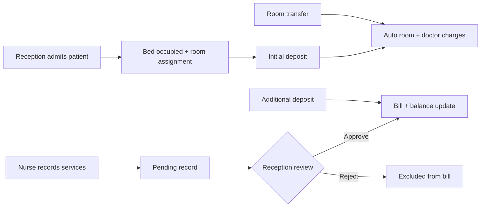

# Project Context

**Product name:** InCare  
**Frontend package:** `in-patients-billing`  
**Backend package:** `medbill-api` / `medbill-server`  
**Domain:** Hospital in-patient billing and deposit management  
**Currency:** Ethiopian Birr (ETB)  
**Demo hospital:** Central City Hospital  

Related documents: [ARCHITECTURE.md](./ARCHITECTURE.md) · [MODULES.md](./MODULES.md) · [BUSINESS_RULES.md](./BUSINESS_RULES.md)

---

## Project purpose

InCare is a role-based web application for managing **in-patient admissions, daily service recording, deposit tracking, and billing** in a hospital setting.

It exists so reception, nursing, administration, and management can share one patient-stay financial record instead of tracking charges and deposits on paper or in disconnected spreadsheets.

---

## Problem it solves

Implemented workflows address:

- Registering an admitted patient with a bed and an initial deposit
- Recording daily clinical services without immediately changing the bill (nurse submissions stay pending)
- Approving or rejecting those submissions at reception
- Applying automatic daily room and doctor-visit charges
- Transferring a patient between rooms while locking the daily rate at assignment time
- Recording additional deposits and printing a deposit receipt or invoice
- Giving managers a read-oriented financial dashboard and exportable reports

---

## Current scope

The repository is a **MERN-style application** with a React SPA and an Express + MongoDB API. The frontend can also run against in-memory mock data when `VITE_USE_API=false`.

| Area | Status in current implementation |
|------|----------------------------------|
| Email/password login + JWT | Implemented |
| Role-gated frontend routes | Implemented (Reception, Nurse, Admin, Manager) |
| Patient admission, deposits, room transfer | Implemented (API + mock fallback) |
| Daily service records and pharmacy returns | Implemented |
| Reception approve / reject | Implemented |
| Automatic room and doctor charges | Implemented on admit and room transfer (API); also generated locally in mock mode |
| Hospital settings and category billing types | Implemented (Admin) |
| Manager dashboard and report export | Implemented (API for Manager/Admin; mock fallback) |
| Admin catalog pages (services, medicines, departments, users, room charges) | UI only — local/mock state, no persistence API |
| Doctor catalog, assignment, and credit admissions | Implemented (API + UI). Doctors persist in MongoDB. |
| Discharge / invoice persistence / user management API | Not implemented |

---

## Out-of-scope features

The following are **not implemented**. Do not treat them as product capabilities:

- Out-patient / emergency / appointment scheduling
- Pharmacy stock control that affects billing inventory
- Insurance claims or payer billing
- Patient discharge clearance workflow (a `pending-discharge` status exists on the Patient model and in mock data, but no discharge API or UI action exists)
- Real-time notifications (bell alerts are derived from in-memory pending records)
- Refresh tokens, password reset, or user self-service
- User CRUD, role assignment, or audit-log persistence as a first-class collection
- PDF generation library (reports use browser print / CSV download)
- Multi-hospital / multi-tenant support
- CI, automated tests, or a documented production deployment pipeline — **Unknown from current implementation** beyond `vite build` and `node src/index.js`

---

## Target users

| Role (API enum) | Frontend `roleKey` | Intended work |
|-----------------|--------------------|---------------|
| Reception | `reception` | Admit patients (including credit), collect deposits, select visiting doctors, approve nurse records, transfer rooms, print invoices |
| Nurse | `nurse` | Record daily services and pharmacy returns; add visiting doctors to an admitted patient; no catalog price edits |
| Admin | `admin` | Hospital settings, doctor catalog (create/edit/activate, visit prices), category billing types |
| Manager | `manager` | KPIs, charts, and report print/CSV export |

Demo accounts created by `server/scripts/seed.js`:

| Role | Email | Password |
|------|-------|----------|
| Reception | `reception@cc` | `password` |
| Nurse | `nurse@cc` | `password` |
| Admin | `admin@cc` | `password` |
| Manager | `manager@cc` | `password` |

`users.txt` lists `@stgabriel.et` emails. Those addresses are **not** what the seed script or `src/data/mockData.js` use. See [KNOWN_ISSUES.md](./KNOWN_ISSUES.md).

---

## Technology stack

| Layer | Technology |
|-------|------------|
| Frontend | React 18, Vite 6, React Router 6, Tailwind CSS 3, Radix/shadcn-style UI, Lucide, Recharts |
| Frontend state | React Context (no Redux) |
| Backend | Node.js, Express 4, Mongoose 8, JWT, bcryptjs, CORS, dotenv |
| Database | MongoDB (single database, default name `medbill`) |
| Auth | JWT Bearer token, 7-day expiry, stored in `sessionStorage` |

Details: [DEPENDENCIES.md](./DEPENDENCIES.md) · [ENVIRONMENT.md](./ENVIRONMENT.md)

---

## Architecture style

- **Frontend:** SPA with nested role routes, Context providers, and a thin `src/api/client.js` fetch layer. Dual-mode: live API (default) or mock data.
- **Backend:** Express routers over Mongoose models. Business logic lives mostly in route handlers. The only dedicated service module is automatic daily charges (`server/services/autoCharges.js`).
- **No repository layer, no separate DTO classes, no dependency injection container.** Response shaping is done by mapper functions in `server/utils/mappers.js`.

Details: [ARCHITECTURE.md](./ARCHITECTURE.md)

---

## Major modules

| Module | Responsibility |
|--------|----------------|
| Auth | Login, JWT, `/me`, frontend `RequireAuth` |
| Patients | Admission, listing, deposits, room transfer, doctor-visit toggle |
| Beds / Rooms | Inventory and availability |
| Service records | Daily services, pharmacy returns, approve/reject |
| Auto charges | Room + doctor daily lines |
| Settings | Hospital identity, billing thresholds, category billing types |
| Manager | Dashboard aggregates and reports |
| Admin UI (frontend-only) | Services, medicines, departments, doctors, users, room-charge cards |

Details: [MODULES.md](./MODULES.md)

---

## Overall workflow

---

## High-level data flow

1. Browser stores JWT in `sessionStorage` (`medbill_token`) after `POST /api/auth/login`.
2. Contexts load patients, records, settings, and categories via `/api/*` when `VITE_USE_API` is not `'false'`.
3. Writes (admit, deposit, record, approve, transfer) go to Express, which updates MongoDB collections.
4. Balance is **not stored**. It is computed as `depositTotal − sum(approved record totals)` on the server (`calcPatientBalance`) and again on the client (`getPatientBalance`).
5. Printed invoices and deposit receipts are generated in the browser from current client state. They are not stored as documents.

When `VITE_USE_API=false`, steps 2–4 stay in React state seeded from `src/data/mockData.js` and are lost on refresh.
